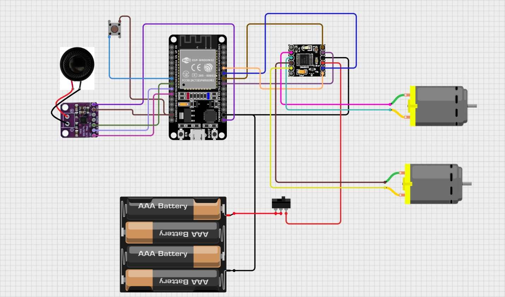
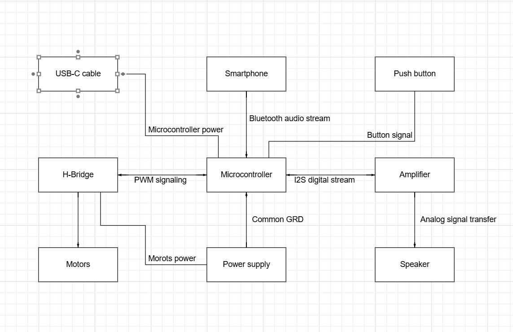

# ESP32-Based Audio-Synced Animatronic Project 🎶🐟  
**Modernized Interactive Audio Toy**

## 🧠 Overview

This project modernizes the iconic 2000s "Big Mouth Billy Bass" animatronic fish by turning it into a Bluetooth speaker that synchronizes its mouth, head, and tail movements with any music in real time using embedded audio analysis.

The upgrade was implemented as a **Bachelor’s thesis** in **Computer Science**, combining **embedded systems**, **digital signal processing**, and **Bluetooth audio streaming** on a resource-constrained microcontroller — the **ESP32**.

📑 Also see a project [Presenataion](./docs/Presentation.pptx).

---

## 🎯 Features

- Bluetooth Audio Receiver (A2DP) via ESP32  
- Real-Time Audio Frequency Analysis with FFT  
- Synchronized Movement of mouth, head, and tail based on music  
- Low-Latency Playback (≤500ms delay)  
- Powered via USB-C and external motor power  
- Reuses original DC motors and mechanical transmission  
- Best performance with clear rhythmic music (e.g. hip-hop, pop)  

---

## 🎥 Demo

- [Demo 1 (MP4)](./media/demo1.mp4)
- [Demo 2 (MP4)](./media/demo2.mp4)

---

## 🧰 Hardware Used

- ESP32 DevKit (WROOM-32, 30-pin)
- MAX98357A I2S Amplifier
- YD 40-17 3W 4Ω Speaker
- 2 × DC 3V–6V Motors (type 270)
- DRV8833 Dual H-Bridge Motor Driver
- Adjustable power supply (USB-C for ESP32, 6V adapter for motors)
- Original *Big Mouth Billy Bass* toy
- Consumables: wires, heat shrink, solder, double-sided tape, etc.

---

## ⚡ Electrical Schematic

---

## 🔧 Block Diagram

---

## 🧱 System Architecture

- ESP32 receives Bluetooth audio via A2DP
- Audio streamed over I2S to the MAX98357A amplifier
- Audio data is processed via FFT to extract bass and vocals
- Based on analysis, PWM signals are sent to DRV8833 to control motors

| Signal Type | Controls |
|-------------|----------|
| 300–1500 Hz | Mouth (vocals) |
| 0–150 Hz    | Head & Tail (bass) |

> Custom logic for peak detection, smoothing, and motor triggering ensures expressive and responsive movement is described in [Thesis](./docs/Thesis.pdf).

---

## 💻 Software Stack

- **Platform**: Arduino IDE (C++)
- **Libraries**:
  - [`AudioTools`](https://github.com/pschatzmann/arduino-audiotools)
  - [`BluetoothA2DPSink`](https://github.com/pschatzmann/ESP32-A2DP)
  - [`arduinoFFT`](https://github.com/kosme/arduinoFFT)

---

## 🧪 Testing & Debugging

- Calibrated motor timing using Serial Monitor
- Tuned `VOCAL_THRESHOLD` and `BASS_THRESHOLD` manually
- Tested with different genres:
  - ✅ Best: Hip-hop, Pop
  - ❌ Worst: Classical, Jazz, Metal

---

## 🚀 Future Improvements

- Wi-Fi control for smart home integration
- Equalizer display via small screen
- Custom 3D-printed case

---

## 📚 Thesis

This project is based on the bachelor’s thesis:

> **"Embedded Audio Analysis for a Modernized Retro Toy"**  
> by Bohdan Yeromenko, 2025  
> Supervisor: Prof. Alexander Shapoval  
> University of Łódź, Department of Artificial Intelligence and Nonlinear Analysis

📄 [Read the full thesis (PDF)](./docs/Thesis.pdf)

---

## 🤝 Acknowledgements

- Espressif for the ESP32 platform
- Adafruit for the MAX98357A documentation
- Authors of the AudioTools, arduinoFFT, and ESP32-A2DP libraries
- Community tutorials from Random Nerd Tutorials & GitHub

---
